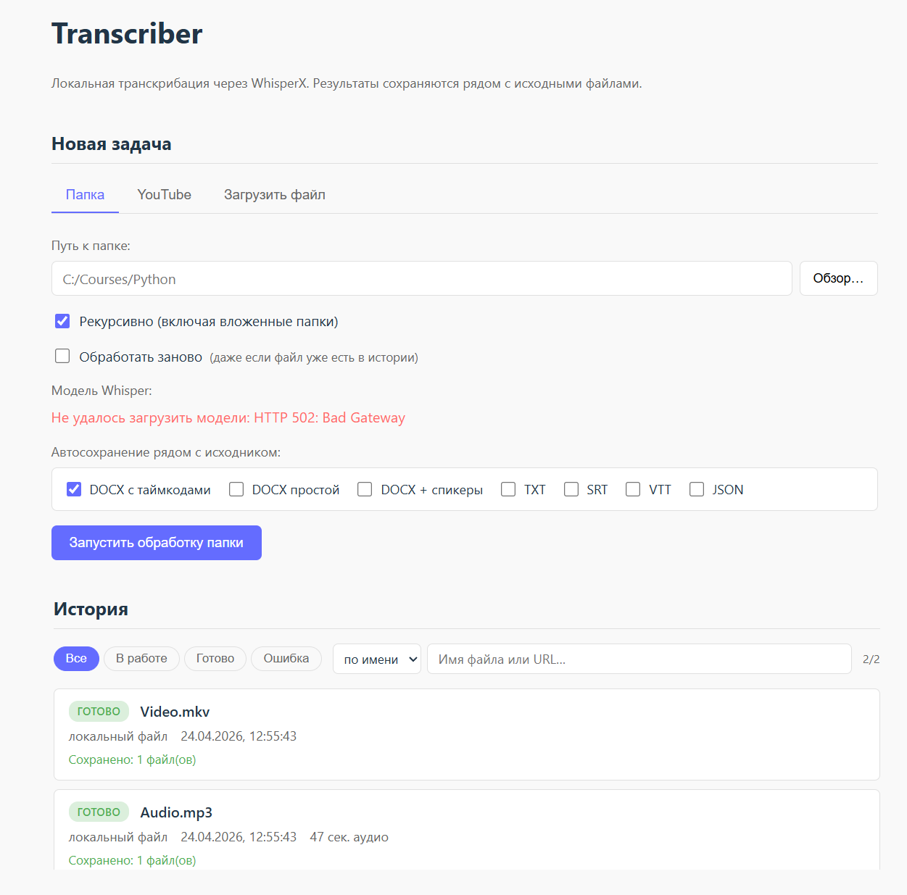
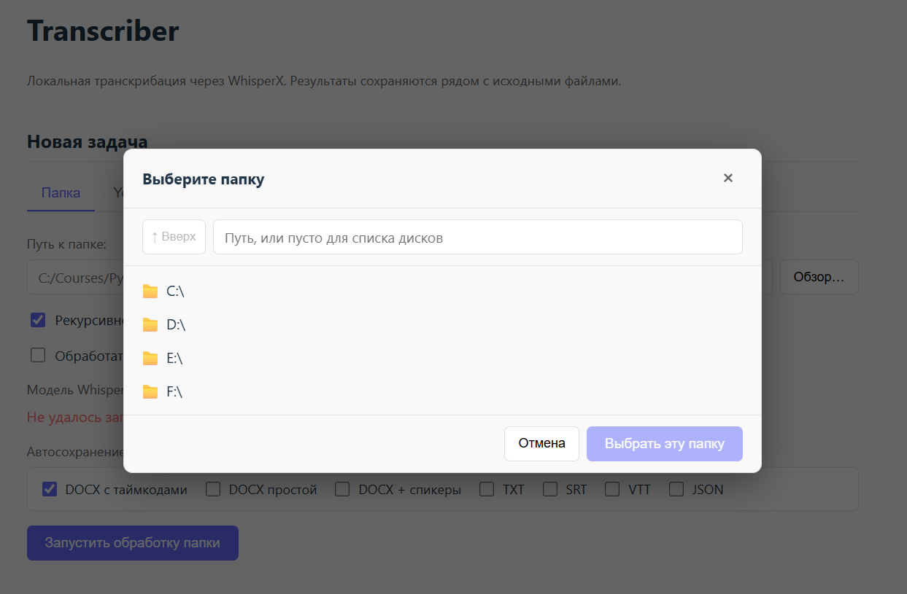
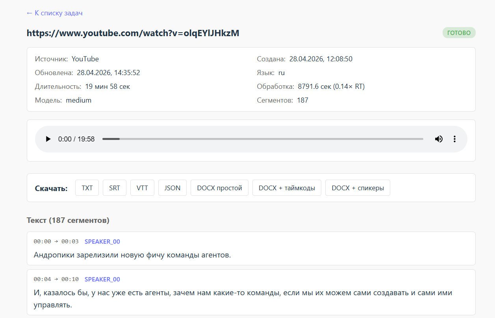
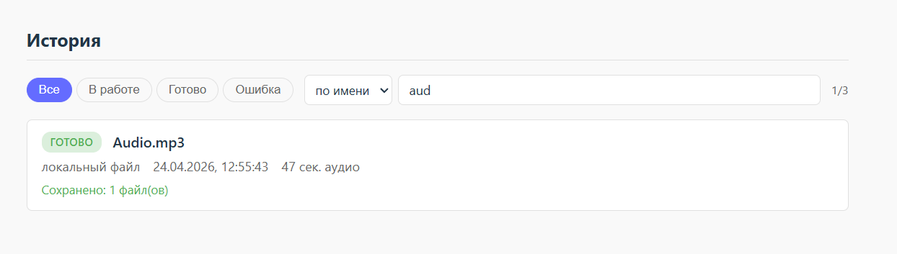

# Transcriber

**English version** → [README.en.md](README.en.md)

Локальное веб-приложение для транскрибации аудио и видео: загружаете файл, папку или YouTube-ссылку — получаете текст с таймкодами и спикерами, плюс экспорт в TXT / SRT / VTT / JSON / DOCX. Всё работает на одной машине, без облачных API: модели крутятся на локальном CPU через WhisperX.

Проект сделан как личный инструмент для транскрибации курсов, подкастов и интервью. Код публикуется как портфолио.



---

## Содержание

- [Что это умеет](#что-это-умеет)
- [Стек](#стек)
- [Архитектурные решения](#архитектурные-решения)
- [Быстрый старт](#быстрый-старт)
- [Скриншоты](#скриншоты)
- [Что я узнал по ходу](#что-я-узнал-по-ходу)
- [Что можно улучшить](#что-можно-улучшить)

---

## Что это умеет

**Четыре способа дать файл на обработку:**
- Загрузка одного файла через браузер (drag-and-drop)
- YouTube-ссылка (скачивается через yt-dlp)
- Одиночный файл на диске по абсолютному пути
- Рекурсивный обход папки — батч-обработка на «уйти делать другие дела»

**Поддержка видеоформатов** — `.mp4`, `.avi`, `.mkv`, `.mov`, `.webm` и другие. Аудиодорожка извлекается ffmpeg'ом «на лету» и кэшируется.

**Выбор качества vs скорость.** В интерфейсе переключаются модели Whisper: `base`, `small`, `medium`, `large-v3-turbo`. Выбор запоминается в браузере. На сервере крутится LRU-кэш на 2 модели, чтобы не тратить RAM впустую, но и не перезагружать с диска при каждом переключении.

**Диаризация** через pyannote — разделение по спикерам (`SPEAKER_00`, `SPEAKER_01`, ...).

**Опциональный перевод** речи на английский (встроенная возможность Whisper).

**Экспорт в 7 форматов:** TXT, SRT, VTT, JSON, DOCX (в трёх стилях: только текст / с таймкодами / с таймкодами и спикерами). Для батч-обработки файлы автоматически сохраняются рядом с исходником: `lecture_01.mp4` → `lecture_01.timecoded.docx`.

**Плеер с синхронизацией.** На странице задачи — HTML5-плеер, который играет оригинальное аудио. Сегменты подсвечиваются в реальном времени, клик по сегменту перематывает на нужную позицию. Сервер отдаёт аудио с HTTP Range-поддержкой, поэтому seek работает мгновенно.

**Персистентность и поиск.** Задачи хранятся в SQLite и переживают перезапуск. Полнотекстовый поиск по содержимому через FTS5 — находит все транскрипты, где встречается слово или фраза.

**Дедупликация.** Если запускаете обработку той же папки повторно, уже готовые файлы пропускаются. Галочка «Обработать заново» форсирует повтор.

---

## Стек

**Бэкенд** — Python 3.11, FastAPI, WhisperX (faster-whisper под капотом + pyannote для диаризации), yt-dlp, ffmpeg, python-docx. Хранилище — SQLite с FTS5-индексом. Без ORM — сырой SQL через модуль `sqlite3`.

**Фронтенд** — React 18, Vite, React Router. Без state-менеджера (useState/useEffect хватает). Без UI-фреймворка — свой CSS на переменных с поддержкой тёмной/светлой темы.

**Инфраструктура** — запуск через `uvicorn` (бэкенд) и `vite dev` (фронтенд) в два терминала. Vite проксирует `/api/*` → `localhost:8000`, чтобы CORS не мешал.

**Железо для разработки** — Intel i5-2500 (Sandy Bridge, без AVX2), 16 GB RAM, без поддерживаемого GPU. Всё на CPU. На этом железе `small` даёт ~1× RT (реального времени), `medium` — ~0.3×, `large-v3-turbo` — ~0.3×.

---

## Архитектурные решения

Короткий лог важных выборов по ходу разработки.

**Фоновые задачи через `BackgroundTasks` FastAPI, не Celery.** Для однопользовательского инструмента Celery + Redis — оверкил. `BackgroundTasks` запускает функцию в отдельном потоке после возврата HTTP-ответа. Минус: задачи не переживают рестарт сервера — если в момент `Ctrl+C` была `processing`, она останется `processing` навсегда. Для личного использования приемлемо (в худшем случае — перезапускаем файл руками).

**Whisper через CPU с `int8`-квантованием.** На Sandy Bridge без AVX2 это единственный способ получить приемлемую скорость. `float16` на CPU работает медленнее. GPU недоступен (старая карта не поддерживается актуальным PyTorch).

**LRU-кэш моделей на 2 слота.** Держать все 4 модели в RAM — прожигает ~10 ГБ впустую. Перезагружать при каждой смене — 30-60 сек пауза. Компромисс: две самых недавних модели в памяти. При переключении между `small` и `medium` туда-сюда обе остаются; если добавится третья — вытесняется самая давняя.

**`audio_cache/` для извлечённых из видео дорожек.** Видеофайлы курсов весят ГБ, 90% этого — видеопоток, не нужный для транскрибации. ffmpeg извлекает звук в компактный m4a 16 кГц mono 128 kbps. Ключ кэша — хэш от абсолютного пути + mtime + размер, чтобы при изменении исходника кэш инвалидировался.

**Файлы загрузок сохраняются под `<task_id>.<ext>`.** Изначально имена генерировались отдельным uuid, а task_id создавался параллельно — связь между задачей и файлом на диске терялась. Переделал так, чтобы task_id был и именем файла: `_locate_source` теперь находит файл по glob-паттерну без дополнительных полей в схеме.

**Свой Range-хендлер для аудиостриминга.** `FileResponse` из FastAPI/Starlette в моей версии не всегда отдаёт `Accept-Ranges: bytes`, из-за чего HTML5-плеер не может делать seek (скачивает файл с нуля). Написал свою реализацию на `StreamingResponse`: парсит `Range: bytes=START-END`, отвечает `206 Partial Content` с нужным куском. Работает на 100% стабильно.

**Сырой SQL вместо ORM.** Одна таблица `tasks`, одна `segments`, одна `exported_files`, плюс FTS5 virtual table для поиска. Схема простая, миграции в одном файле через `PRAGMA user_version`. SQLAlchemy был бы избыточен и скрыл бы SQL за абстракцией.

**FTS5 с триггерами для синхронизации.** Сегменты хранятся в основной таблице, FTS-индекс — отдельной `virtual table` с `content='segments'`. Триггеры `AFTER INSERT/UPDATE/DELETE` автоматически обновляют индекс. Поиск через `MATCH` работает мгновенно даже на сотнях задач.

**Дедупликация по `local_source_path`.** В таблице `tasks` есть частичный индекс `WHERE local_source_path IS NOT NULL`. Перед созданием LOCAL-задачи проверяем, нет ли уже завершённой с таким же путём — если есть, возвращаем её task_id. Галочка `force=true` обходит проверку.

**Прокси Vite вместо CORS на бэкенде.** Во время разработки фронт на `localhost:5173`, бэк на `localhost:8000` — кросс-доменные запросы. Вместо настройки CORS-заголовков прописал в `vite.config.js` прокси: `/api/*` → `http://localhost:8000`. Для фронта это выглядит как обращение на тот же хост.

---

## Быстрый старт

### Требования

- Python 3.11
- Node.js 22 LTS
- ffmpeg в PATH (проверить: `ffmpeg -version`)
- HuggingFace-токен для диаризации (опционально) — принять условия на моделях `pyannote/speaker-diarization-community-1` и `pyannote/segmentation-3.0`

### Установка

```bash
git clone https://github.com/keen777/transcriber.git
cd transcriber

# Бэкенд
cd backend
python -m venv .venv
.venv\Scripts\Activate.ps1       # Windows PowerShell
# source .venv/bin/activate      # Linux/Mac
pip install -r requirements.txt

# Фронтенд
cd ../frontend
npm install
```

### Настройка

В `backend/` создайте `.env`:

```env
WHISPER_MODEL=small
HF_TOKEN=hf_xxxxxxxxxxxxxxxxxx   # опционально, для диаризации
```

### Запуск

Терминал 1 — бэкенд:
```bash
cd backend
.venv\Scripts\Activate.ps1
uvicorn app.main:app --reload
```

Терминал 2 — фронтенд:
```bash
cd frontend
npm run dev
```

Откройте http://localhost:5173/

Swagger-документация API — http://localhost:8000/docs

---

## Скриншоты

### Главная страница — формы и история


### Выбор папки через встроенный браузер файловой системы


### Страница задачи — метаданные, плеер, сегменты, экспорт


### Полнотекстовый поиск по транскриптам


---

## Что я узнал по ходу

Этот проект был моим первым веб-приложением. Некоторые вещи, которые пришлось разобрать:

**ML-стек на старом CPU под Windows.** WhisperX с PyPI оказался устаревшим — нужна main-ветка с GitHub. Совместимость версий `faster-whisper` / `pyannote` / `torch` пришлось подбирать вручную: одна версия ломала API, другая требовала GPU-фичи. В итоге — список точных версий в `requirements.lock.txt`.

**Async / sync в FastAPI + BackgroundTasks.** Whisper — синхронный CPU-bound процесс. Запускать его через `async def` бессмысленно — блокирует event loop. Использовал sync-функцию в `BackgroundTasks`, которая автоматически уходит в threadpool.

**HTTP Range-запросы.** Понять, почему HTML5-плеер не умеет seek, пришлось через DevTools Network — там должны быть запросы со статусом 206. Когда не было — стало ясно, что сервер не отдаёт `Accept-Ranges`.

**React-хуки, когда компонент быстро перерисовывается.** Полинг `setInterval` внутри `useEffect` с правильным cleanup — типичный паттерн, но на нём легко сделать утечки. `cancelled` флаг — обязательный.

**SQLite FTS5 и `UNICODE61` токенизатор.** Без этого токенизатора поиск по русскому тексту не работает — он токенизирует только ASCII. Ещё нужны триггеры `AFTER INSERT/UPDATE/DELETE`, чтобы FTS-индекс не отставал от основной таблицы.

**Пути с кириллицей в JSON.** `"C:\Users\User\Видео\..."` в JSON ломается на `\U` и `\k`. Решение — прямые слэши или двойные обратные. В POST-формах теперь явно говорится пользователю об этом.

**Отдельный python-процесс для каждого реквеста.** При тесте БД оказалось, что задача не попадает в `.db` — WAL-журнал держится, пока живо соединение. В многопоточной FastAPI делаю `sqlite3.connect()` через `threading.local()`, чтобы каждый поток имел своё соединение.

---

## Что можно улучшить

- **Кэш транскрипций для YouTube-ссылок** по URL (сейчас дедупликация только для локальных файлов)
- **Саммаризация** через Claude/OpenAI API — кнопка «TL;DR» на странице задачи
- **Перевод EN→RU / любые пары** через NLLB или облачный API
- **Электрон/Tauri-обёртка** для системного файлового диалога (сейчас — свой браузер файловой системы в модалке)
- **Очистка старых аудио-кэшей** по расписанию
- **Celery + Redis**, если понадобится многопользовательский режим

---

## Лицензия

Проект распространяется под лицензией MIT — см. файл [LICENSE](LICENSE).

---

## Контакты

Автор — [@ea-vershinin](https://github.com/ea-vershinin)
